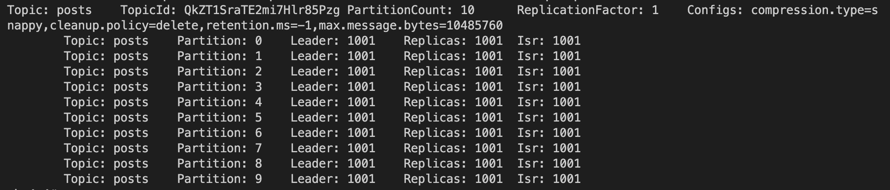
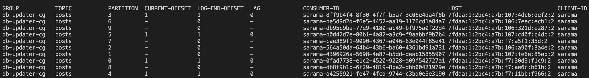

# EDS workshop cheatsheet

## Fly commands

`$ fly deploy ` -- deploy app  
`$ fly ssh console -s` -- log into the container  
`$ fly status` -- display status of the app  
`$ watch fly status` -- install watch and follow up status changes how they happen  
`$ fly scale count 10` -- scale app instance to 10  
`$ fly logs -i <id>` -- follow the logs of an app instance  

## Kafka commands

* describe server properties  
    `$ cat ./etc/kafka/server.properties`  

* log directory (where messages are stored!)  
    `log.dirs=/var/lib/kafka`

* list kafka topics  
    `$ ./bin/kafka-topics --bootstrap-server=localhost:9092 --list ` 
* describe kafka topic properties  
    `$ ./bin/kafka-topics --bootstrap-server=localhost:9092 --describe --topic posts `  

    

* delete kafka topics  
    `./bin/kafka-topics --bootstrap-server=localhost:9092 --delete --topic posts`  

* list consumer groups  
	`./bin/kafka-consumer-groups --bootstrap-server=localhost:9092 --list`  

* describe consumer group properties  
    `./bin/kafka-consumer-groups --bootstrap-server=localhost:9092 --group db-updater-cg --describe`

    